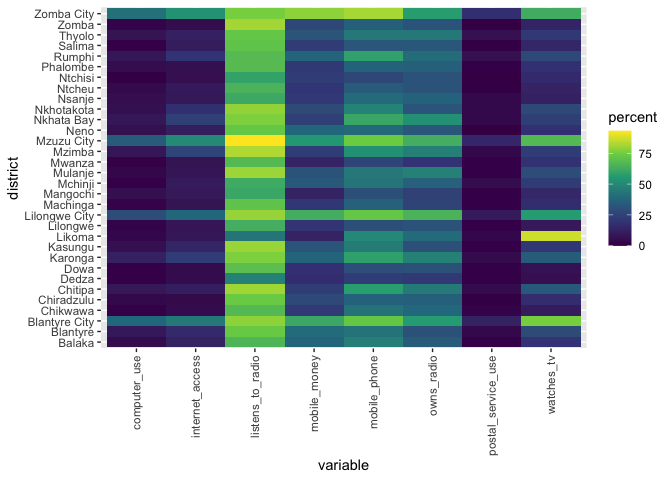

# Source

Page 130:
http://www.nsomalawi.mw/images/stories/data_on_line/economics/ICT/ICT%20Household%20Survey%202019.pdf

Table title: Proportion of Individuals by Ownership of and Access to ICT
Equipment and Services by District, ICT 2019

# Table

| district      | owns_radio | listens_to_radio | watches_tv | computer_use | mobile_phone | internet_access | mobile_money | postal_service_use |
|:--------------|-----------:|-----------------:|-----------:|-------------:|-------------:|----------------:|-------------:|-------------------:|
| Chitipa       |       44.7 |             81.1 |       33.4 |          8.6 |         57.0 |            11.3 |         22.5 |                4.1 |
| Karonga       |       47.2 |             76.6 |       34.1 |         12.0 |         58.2 |            22.0 |         36.9 |                4.3 |
| Nkhata Bay    |       52.2 |             76.8 |       23.4 |          8.1 |         60.7 |            24.0 |         24.0 |                3.8 |
| Rumphi        |       39.9 |             68.0 |       27.6 |          8.1 |         58.5 |            19.3 |         36.9 |                6.0 |
| Mzimba        |       46.5 |             83.2 |       22.6 |          8.3 |         51.9 |            25.9 |         22.3 |                3.6 |
| Likoma        |       39.3 |             42.6 |       86.9 |          3.3 |         49.2 |             8.2 |         13.1 |                3.3 |
| Mzuzu City    |       63.2 |             93.1 |       67.9 |         34.1 |         74.5 |            50.0 |         54.9 |               14.3 |
| Kasungu       |       29.8 |             80.5 |       20.7 |          5.6 |         45.4 |            13.7 |         31.4 |                2.0 |
| Nkhotakota    |       31.6 |             79.3 |       27.0 |          5.7 |         48.2 |            17.5 |         28.1 |                3.6 |
| Ntchisi       |       31.1 |             59.1 |       16.0 |          1.3 |         26.6 |             5.5 |         22.3 |                0.4 |
| Dowa          |       30.5 |             69.8 |        6.7 |          1.8 |         29.3 |             4.3 |         17.8 |                2.0 |
| Salima        |       32.6 |             71.3 |       14.4 |          2.6 |         32.2 |            10.3 |         22.3 |                1.1 |
| Lilongwe      |       31.1 |             63.1 |        9.0 |          3.1 |         29.5 |             7.6 |         19.8 |                1.8 |
| Mchinji       |       35.3 |             61.9 |       22.9 |          2.5 |         42.9 |             9.8 |         33.3 |                5.0 |
| Dedza         |       21.4 |             47.2 |        5.4 |          1.9 |         22.7 |             4.4 |         16.8 |                2.6 |
| Ntcheu        |       31.2 |             64.9 |       13.0 |          3.9 |         33.5 |             9.5 |         20.1 |                1.0 |
| Lilongwe City |       65.0 |             80.0 |       56.2 |         28.8 |         72.4 |            37.5 |         63.0 |                9.9 |
| Mangochi      |       24.5 |             60.4 |       14.9 |          5.6 |         29.5 |             8.9 |         13.1 |                2.2 |
| Machinga      |       25.4 |             71.1 |       16.6 |          2.8 |         35.3 |             7.2 |         20.8 |                2.0 |
| Zomba         |       30.9 |             81.6 |       13.4 |          3.0 |         35.2 |             4.7 |         26.9 |                0.6 |
| Chiradzulu    |       35.2 |             73.8 |       16.6 |          3.7 |         36.0 |             3.9 |         27.3 |                0.6 |
| Blantyre      |       30.4 |             73.5 |       28.2 |          8.8 |         42.3 |            15.5 |         39.7 |                3.8 |
| Mwanza        |       19.1 |             67.7 |       18.7 |          1.7 |         25.5 |             7.2 |         13.2 |                2.1 |
| Thyolo        |       44.4 |             72.5 |       21.3 |          7.2 |         44.0 |            11.9 |         31.9 |                6.4 |
| Mulanje       |       47.4 |             80.6 |       28.5 |          3.2 |         43.9 |             7.6 |         30.9 |                2.2 |
| Phalombe      |       35.1 |             68.4 |       18.4 |          4.9 |         36.0 |             5.7 |         21.3 |                2.2 |
| Chikwawa      |       37.9 |             67.9 |       10.2 |          2.1 |         42.3 |             4.5 |         21.8 |                3.0 |
| Nsanje        |       36.1 |             61.4 |       11.9 |          5.3 |         39.6 |             8.6 |         20.9 |                3.7 |
| Balaka        |       33.5 |             65.8 |       19.1 |          4.5 |         46.2 |            12.6 |         37.4 |                1.8 |
| Neno          |       32.0 |             72.6 |       17.8 |          5.8 |         39.0 |            10.8 |         37.8 |                0.0 |
| Zomba City    |       56.8 |             75.9 |       62.3 |         41.2 |         81.9 |            53.3 |         78.9 |               17.1 |
| Blantyre City |       56.3 |             78.8 |       75.9 |         37.5 |         72.8 |            44.5 |         61.1 |               12.4 |

# Plot

